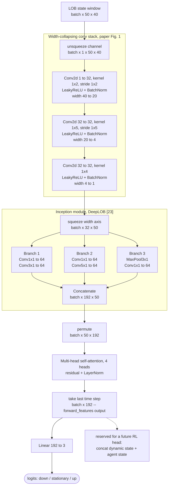

# Attn-LOB Model

This page documents `paper_replication.models.attn_lob` — the CNN-Attention
network from the paper (Section III-B3, Fig. 1) that turns a window of raw
limit order book snapshots into a prediction of where the mid-price is
headed next. See
[notebooks/04_attn_lob_model.ipynb](notebooks/index.md) for a runnable
walkthrough that builds this model and runs it on real data, and the
[API Reference](api/index.md) for the full auto-generated docstrings.

**The model is not trained anywhere in this repo yet.** Everything here is
the architecture and a forward-pass sanity check — no optimizer, no
training loop.

## In plain English

Feed the model a short "movie" of the order book — the last 50 snapshots,
40 numbers each (10 price levels x ask/bid x price/size) — and it has to
guess whether the price is about to go up, down, or stay flat.

It does this in three stages, each answering a different question:

1. **"What does this one snapshot look like?"** A stack of convolutions
   scans across the 40 numbers in each snapshot and compresses them down
   to a compact 32-number summary, one per snapshot. This is the same idea
   as running a filter across nearby pixels in an image, except here the
   "image" is the order book's price levels.
2. **"What's changed recently, at different time scales?"** An Inception
   module looks at the sequence of 32-number summaries with three filters
   of different widths in parallel — a quick glance, a medium look-back,
   and a longer one — and stacks their answers together into a richer
   192-number-per-snapshot representation.
3. **"Which of the last 50 moments actually matters most right now?"** A
   self-attention layer lets the model weigh every snapshot in the window
   against every other one, then the model keeps the "most informed"
   version of the *last* snapshot as a single 192-number summary of the
   whole window. That summary is fed into a small classifier that outputs
   three numbers: how likely the price is going down, staying flat, or
   going up.

That's the whole model: **compress each snapshot, look at it across
multiple time scales, let the model decide which recent moments matter, and
classify.**

## Architecture diagram

## Why our version differs from the paper

The paper's Fig. 1 is a figure extracted from a scanned PDF, so it's not
fully specified in text — a few details had to be filled in with a
documented, standard choice rather than a guess at unstated internals:

| Detail | Paper | This implementation |
|---|---|---|
| Attention head count | Not stated | 4 heads (192 is evenly divisible: 48/head) |
| Residual + LayerNorm around attention | Not shown in Fig. 1 | Added — standard transformer-block practice |
| Pooling the attention output | Fig. 1 shows a "1 x 192" shape feeding the pretrain head, but doesn't say how | Take the *last* time step's output — the natural analogue of "take the final hidden state," which is what the LSTM-based architecture ([19], [23]) this paper modifies would have done |
| Model scope | Fig. 1 also shows a "Concatenate" box combining LOB state + dynamic state + agent state, feeding an "Action Space MLP" (for the RL phase) | Not built yet — this implementation is only the pretrain-task backbone + classification head (Table I: LOB state only, input 50x40). `forward_features()` exposes the pooled 192-dim vector so the RL head can be added later without touching this module |

## The code

**`AttnLOBConfig`** — a frozen dataclass holding the architecture's
hyperparameters (`n_levels`, `conv_hidden_dim`, `inception_channels`,
`attn_heads`, `num_classes`). `embed_dim` is a derived property
(`3 * inception_channels`, i.e. 192 by default) rather than a separate
field, so it can never drift out of sync with `inception_channels`.

`n_levels=10` is the paper's own setup, and what our
[feature engineering pipeline](feature_engineering.md) produces by default.
The conv stack's final layer collapses width `4*n_levels` down to `1`, which
requires `n_levels` to be a multiple of 5 (`ConvBlock` raises `ValueError`
otherwise, rather than silently building a mismatched architecture) — other
multiples of 5 are supported for depth ablations that deviate from the
paper, e.g. `n_levels=50` in
[Exp 3](experiments.md#exp-3-attn-lob-lob-depth-ablation-btcusdt-2022-10-20-only).

**`AttnLOB`** — the `torch.nn.Module`:

- `forward_features(lob_state)` — `(batch, T, 4*n_levels) -> (batch, embed_dim)`.
  Runs the conv stack, Inception module, and self-attention block; returns
  the pooled 192-dim backbone representation. This is the method a future
  RL-phase head would call.
- `forward(lob_state)` — `(batch, T, 4*n_levels) -> (batch, num_classes)`.
  Calls `forward_features` and applies the pretrain classification head
  (`Linear(192, 3)`) on top.

With the default config: **197,987 parameters** (paper reports 176,320 for
their Attn-LOB in Table I — same order of magnitude; ours doesn't match
exactly since BatchNorm adds parameters and a few Fig. 1 details, like
attention heads, aren't specified precisely enough to reproduce bit-for-bit).

## Where things live

| What | Where |
|---|---|
| Model code | `src/paper_replication/models/attn_lob.py` |
| Unit tests (shapes, gradient flow, config validation) | `tests/test_models_attn_lob.py` |
| Runnable walkthrough on real data | `notebooks/04_attn_lob_model.ipynb` |
| Feature pipeline that produces the model's input | [Feature Engineering Pipeline](feature_engineering.md) |
| Auto-generated API docs | [API Reference](api/index.md) |
