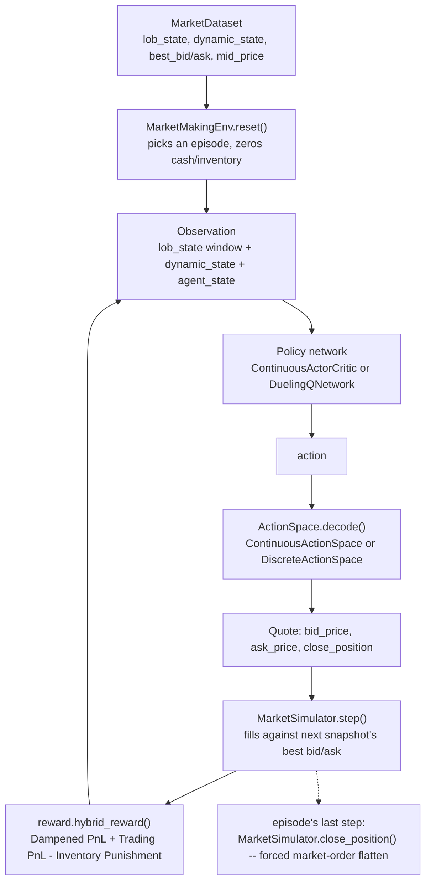

# RL Market-Making Model

This page documents `paper_replication.rl` — the market-making environment,
simulator, action spaces, reward function, and networks from the paper's RL
phase (Section III-C, III-D, III-E, IV-C). See the
[API Reference](api/index.md) for full auto-generated docstrings.

This page covers the environment, action spaces, reward function, and
network architectures. Training (PPO for the continuous space, Dueling DQN
for the discrete space) is `rl/ppo.py` and `rl/dqn.py`, covered at the
bottom of this page and in [Experiments](experiments.md#exp-4-rl-market-making-c-ppo-vs-d-dqn-vs-baselines-btcusdt) — mirroring how `models/attn_lob.py`
(architecture) came before `training/loop.py` (the pretrain training loop).

## In plain English

Everything on the [Attn-LOB page](attn_lob_model.md) turns a window of the
order book into a single 192-number summary. This page is what happens
*after* that: an agent looks at that summary — plus a "mood of the market"
reading and its own current inventory — and decides where to place a buy
quote and a sell quote. Every few seconds, a simulated exchange checks
whether the real historical market would have traded against those quotes;
if so, the agent's cash and inventory update. At the end of a short episode,
any leftover position is forced flat with a market order, and the agent is
scored on how well it captured spread without taking on too much risky
inventory.

That's the whole environment in one sentence: **quote a price, see if the
market would have traded with you, get paid for capturing spread and
penalized for holding risk, repeat for a few minutes, then close out.**

## Architecture diagram

## Why our version differs from the paper

The paper's execution model assumes a raw order-event log ("the simulator
executes the agent's order only when the real historical order arrives").
Our data is the same fixed ~10s snapshot grid used throughout this
replication (see [Feature Engineering](feature_engineering.md#why-our-version-differs-from-the-paper)),
not an event log, so a few things are necessarily adapted rather than
copied verbatim:

| Detail | Paper | This implementation |
|---|---|---|
| Fill timing | Executes the instant a real order crosses the agent's resting quote | Executes if the *next* snapshot's opposing best price has crossed the agent's quote — the snapshot-grid analogue of the same rule (`simulator.py`) |
| `minimum_trade_unit` | 100 shares (China A-shares) | `0.001` BTC by default — a documented substitute for this asset, not a paper number (`RLConfig.minimum_trade_unit`) |
| Episode length | 2000 raw LOB events, "about 3-5 minutes" | `episode_length=30` steps by default, chosen to match the paper's ~5-minute wall-clock episode length rather than its row count — the opposite trade-off the pretraining pipeline made for `window_T`/`horizon_k` (`RLConfig.episode_length`) |
| Discrete action space's 7 quoting actions | "A particular spread and bias" per action — levels not enumerated | A documented, monotonically increasing `(spread, bias)` grid over the same parameters the continuous space uses (`action_space.DiscreteActionSpace.levels`) |
| Continuous policy's action distribution | Not specified | `Beta(alpha, beta)` per action dimension, since Beta's support is exactly `[0, 1]` — the action space's own range — with no boundary bias from clipping/squashing a Gaussian (`networks.ContinuousActorCritic`) |

None of this is hidden — every module says explicitly, in its docstrings,
exactly where it diverges from the paper and why, matching this
replication's existing practice (see the
[Feature Engineering](feature_engineering.md) and
[Attn-LOB Model](attn_lob_model.md) pages for the same treatment of the
pretraining phase).

## The code

**`config.py`** — `RLConfig`: every RL hyperparameter the paper names in
Section IV-C2 (`omega=10`, `eta=0.5`, `zeta=0.01`, `max_bias=0.05`,
`max_spread=0.1`), plus the two fields adapted for this dataset
(`minimum_trade_unit`, `episode_length`) and `initial_cash`. `max_inventory`
is a derived property (`omega * minimum_trade_unit`) so it can't drift out
of sync.

**`market_data.py`** — `build_market_dataset(lob_parquet_path, config, ...)`:
reuses `features.lob_state` and `features.dynamic_state` (the same
window/normalization/dynamic-feature code the Attn-LOB pretraining pipeline
uses) to build a `MarketDataset` — LOB-state windows, dynamic-state
features, and the raw `best_ask`/`best_bid`/`mid_price` series the simulator
executes against. Deliberately does not use `features.dataset` or
`features.labels`: the RL agent doesn't need a precomputed direction label.

**`simulator.py`** — `MarketSimulator`: tracks cash and inventory, executes
quotes against the next snapshot's best bid/ask (`step()`), and force-closes
any open position at market prices (`close_position()`, paper III-C1,
IV-C2). `Fill` records each executed trade with the paper's `Xt,v`
sign convention (`+1` buy, `-1` sell).

**`action_space.py`** — `Quote` (a decoded bid/ask pair, or a close
instruction) plus `ContinuousActionSpace` (paper Eq. 8-11) and
`DiscreteActionSpace` (paper III-C1, 8 actions). Both share
`_reservation_price()`, which biases the quote away from mid-price in the
direction that reduces inventory risk (Eq. 9).

**`reward.py`** — the paper's four reward components as standalone
functions (`delta_pnl`, `dampened_pnl`, `trading_pnl`,
`inventory_punishment`, Eq. 12-15) plus `hybrid_reward` combining them
(Eq. 16: `R_t = DP_t + TP_t - IP_t`).

**`state.py`** — `agent_state_vector(inventory, max_inventory, elapsed_frac)`:
the paper's 2-feature agent state (III-A3) — inventory normalized by
`max_inventory`, and the episode's elapsed-time fraction.

**`env.py`** — `MarketMakingEnv`: the `reset()`/`step()` loop tying the
above together. Episodes are contiguous, non-overlapping blocks of
`config.episode_length` steps; `reset()` zeros cash/inventory and
`step()`'s last call in an episode always force-closes the position,
regardless of the action passed in (paper IV-C2). `Observation` bundles the
three inputs paper Fig. 1 concatenates: `lob_state`, `dynamic_state`,
`agent_state`.

**`networks.py`** — the paper Fig. 1 "Concatenate" → "Action Space MLP"
piece: `RLFeatureExtractor` runs `AttnLOB.forward_features` on the LOB
state, concatenates dynamic and agent state, and feeds a small MLP trunk.
`ContinuousActorCritic` (PPO policy/value head, Beta-distributed actions)
and `DuelingQNetwork` (Dueling DQN Q-network, Wang et al.'s
value/advantage decomposition) both build on this shared extractor —
matching the paper's own choice of Dueling DQN for the discrete space and
PPO for the continuous space (III-E). Both also expose a
`forward_from_lob_features` path that skips the Attn-LOB backbone and takes
its pooled output directly — see `feature_cache.py` below.

## Training

RL training keeps the Attn-LOB backbone **frozen** at its pretrained
weights (loaded via `training.checkpoint.load_checkpoint`) and only updates
the trunk + policy/value (or Q) heads — the same pretrain-then-RL structure
paper Fig. 1 itself depicts. This is also what makes training tractable at
laptop scale: the backbone's output doesn't depend on the agent's actions,
so it's computed once instead of once per RL step.

**`feature_cache.py`** — `precompute_lob_features(attn_lob, lob_state, ...)`:
runs the frozen backbone over an entire `MarketDataset` in large batches
(GPU if available), returning a `(n_steps, embed_dim)` array. `ppo.py` and
`dqn.py` index into this array once per step instead of running the
backbone live — turning the RL loop's dominant cost from "one CNN+attention
forward pass per step" into "one array lookup per step."

**`ppo.py`** — `train_ppo(env, model, lob_feature_cache, config, ...)`:
standard clipped-surrogate PPO (Schulman et al., 2017) with GAE(λ)
advantages, matching the paper's own choice of PPO for the continuous
action space (III-E). The paper doesn't specify PPO's own hyperparameters,
so `PPOConfig`'s defaults are standard values, not paper numbers.

**`dqn.py`** — `train_dqn(env, model, lob_feature_cache, config, ...)`:
standard DQN (Mnih et al., 2015) — target network, epsilon-greedy
exploration, a replay buffer — combined with `DuelingQNetwork`'s dueling
architecture, matching the paper's choice of Dueling DQN. Same caveat:
`DQNConfig`'s defaults aren't paper numbers.

**`baselines.py`** — `RandomPolicy`, `FixedSpreadPolicy`, and
`AvellanedaStoikovPolicy`: the paper's comparison strategies (IV-C3),
adapted to emit this replication's `(A1, A2)` continuous action so every
baseline runs through the *exact same* `MarketMakingEnv` /
`ContinuousActionSpace` / `MarketSimulator` pipeline as C-PPO — no separate
execution path. See the module docstring for exactly how each one diverges
from the paper's own definition (mainly: no raw order-book depth in this
dataset, so "quote at book level N" becomes "quote at spread fraction N").

**`metrics.py`** / **`evaluate.py`** — `EpisodeLog` + `nd_pnl` / `pnlmap` /
`profit_ratio` (paper IV-C4's Table II metrics) and `aggregate_metrics`
(mean/std across episodes, paper's own reporting convention); `run_episode`
/ `evaluate_policy` run any policy — a trained network's greedy/deterministic
wrapper or one of `baselines.py`'s classes — through `MarketMakingEnv` and
compute those metrics, so every policy compared in
[Exp 4](experiments.md#exp-4-rl-market-making-c-ppo-vs-d-dqn-vs-baselines-btcusdt)
goes through one shared harness.

## Where things live

| What | Where |
|---|---|
| Environment/model/training code | `src/paper_replication/rl/` |
| Unit tests | `tests/test_rl_*.py` |
| Runnable training + evaluation walkthrough on real data | `notebooks/09_rl_training.ipynb` |
| Recorded results and discussion | [Experiments — Exp 4](experiments.md#exp-4-rl-market-making-c-ppo-vs-d-dqn-vs-baselines-btcusdt) |
| Feature pipeline reused for market data | [Feature Engineering Pipeline](feature_engineering.md) |
| Attn-LOB backbone reused by the networks | [Attn-LOB Model](attn_lob_model.md) |
| Auto-generated API docs | [API Reference](api/index.md) |
